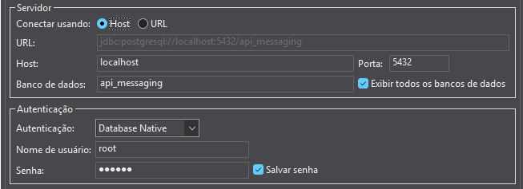

<<<<<<< HEAD
=======
# avaliacao_final_integracao_sistemas

### • Kauan Alexandre Mendes da Silva - RGM: 28952782
### • João Pedro de Oliveira dos Santos Costa - RGM: 30586887
### • Caio Henrique Porcel - RGM: 29945771
### • João Pedro Neumann - RGM: 28636350
### • Vinicius Rebelatto - RGM: 29254761
### • Renan Borges - RGM: 34025015
### • Lucas Treska - RGM: 34131493
### • Matheus Santos - RGM: 29389437


## 

#### Para subir o docker-compose execute no terminal: 
```
cd \PASTA_DO_REPOSTORIO

docker-compose up -d --build
```
##
#### Como subir o POSTGRESS no DBeaver: 
- Clicar em **Nova conexão (CTRL + SHIFT + N)** e escolher **Postgress**
- inserir:
    - Banco de dados: **api_messaging**
    - Nome de usuário: **root**
    - Senha: **secret**         
    

##

#### Como acessar as chaves do Redis:
```
docker exec -it redis_trabalho_final redis-cli

KEYS *
```

##

#### Como utilizar a **Auth_api**: [Clique aqui!](https://github.com/entr0pie/trabalho_final_integracao_sistemas/blob/feat/auth-api/auth_api/README.md)
#### ⚠️ Ao clonar a Auth_api **lembre-se de criar um .env e colar do .env.example**